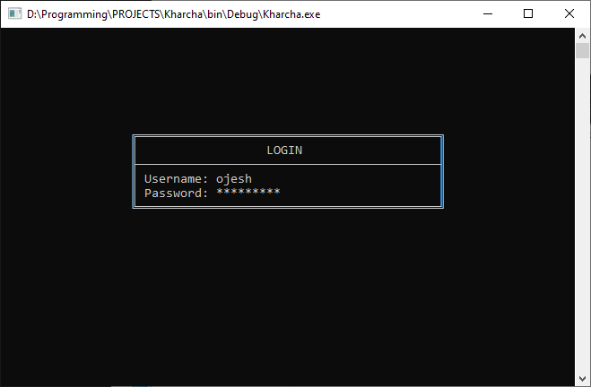
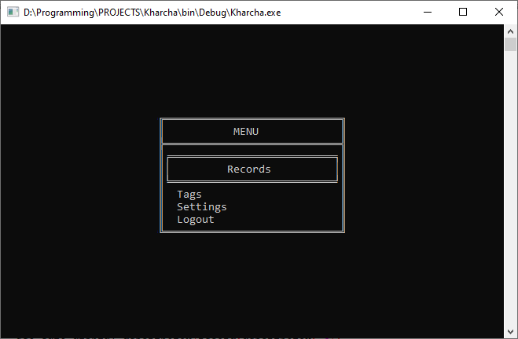
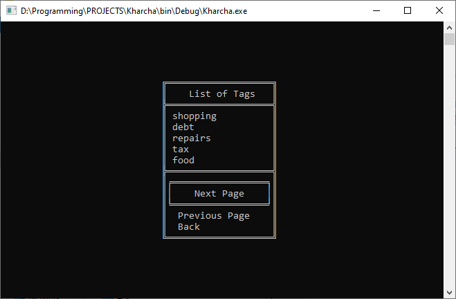
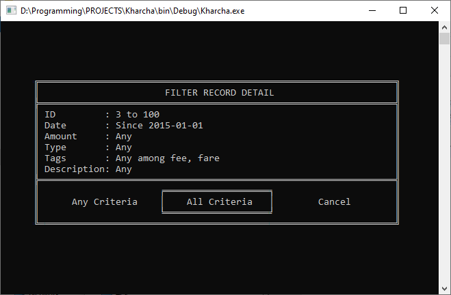
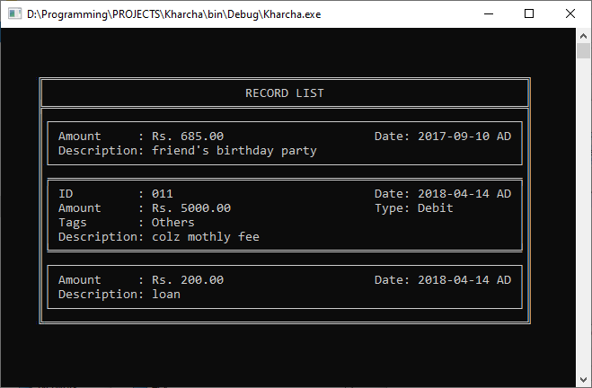

# Kharcha
Program to keep record of money

### Screenshots

### Development
I used **Code::Blocks 17.12** as IDE and compiler on Windows 7.

Tested on Windows 10 but I needed to change the console size as the console is bigger in Win10.

I don't know if it works on Linux distros.....chances are it might not compile at all.

### Important
The files are not ***NOT ENCRYPTED***, so ***passwords*** and other ***text datas*** are ***clearly visible***.

### Features
- Tags are used in records to make them more easy for identification
- Filtering records are easy

### Requisites
Certian function from [QBASIC-func-through-C](https://github.com/OjeshManandhar/QBASIC-func-through-C) are used.

So you need to install this static library in **Code::Blocks** or you can just copy-paste those function.

### About files
- The *Users* folder will hold all the data of users
- The *index.dat* contains the *account number* and *username*
- A folder is created for all users. The folder name will start with their *account number* and proceed with the *username*
- Inside each folder there are three files, *records.dat*, *setting.dat* and *tags.dat*
- *records.dat* contains all the records of the user
- *tags.dat* contains all the tags of the user
- *setting.dat* contains the password of the user
- All the files are ***NOT ENCRYPTED***, so all text datas are clearly visible ***INCLUDING PASSWORD***

### Installing
- Download *main.c*. If you want the tested data download *Users*
- Create a **Console application** project in **CODE::Blocks** if you want
- If you created a project replace the *main.c* in that folder by the *main.c* you downloaded
- Don't forget to install [QBASIC-func-through-C](https://github.com/OjeshManandhar/QBASIC-func-through-C) or copy-paste function from there
- Compile *main.c* or the project

### Further Improvements
If you're interested, feel free to fork and submit PR.
- **Data Encryption and Decryption**
- Better graphics
- A cleaner code....may be in different files :stuck_out_tongue_winking_eye:
- Better comments...sorry few comments are in nepali
- Better algorithms

### License
This project is licensed under the MIT License - see the [LICENSE](LICENSE) file for details.
